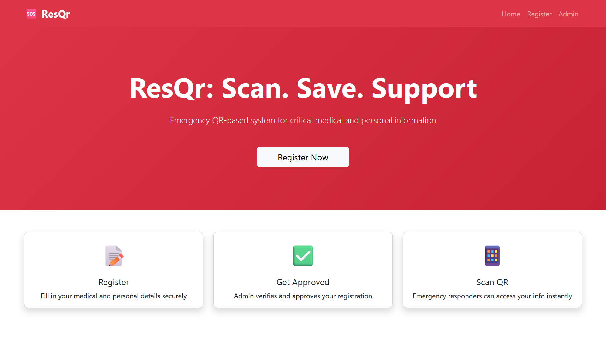
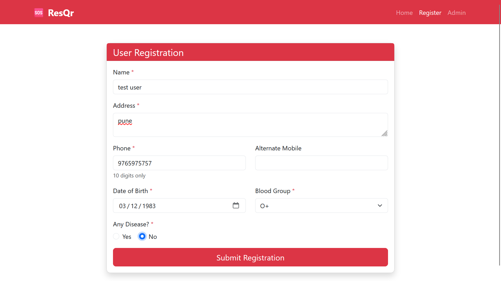
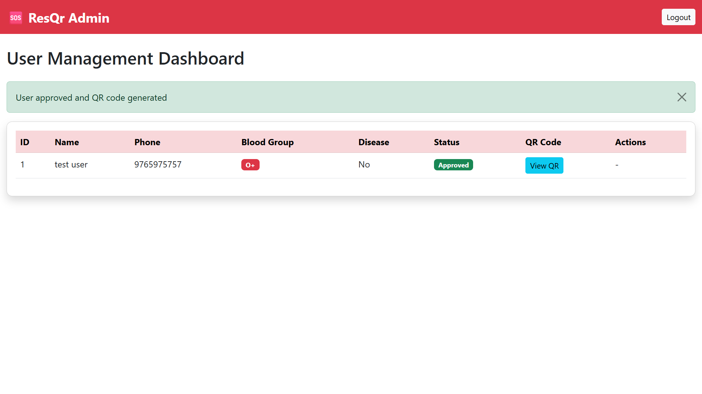
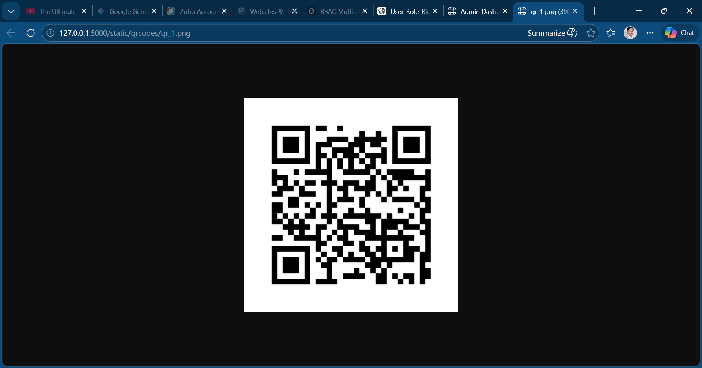
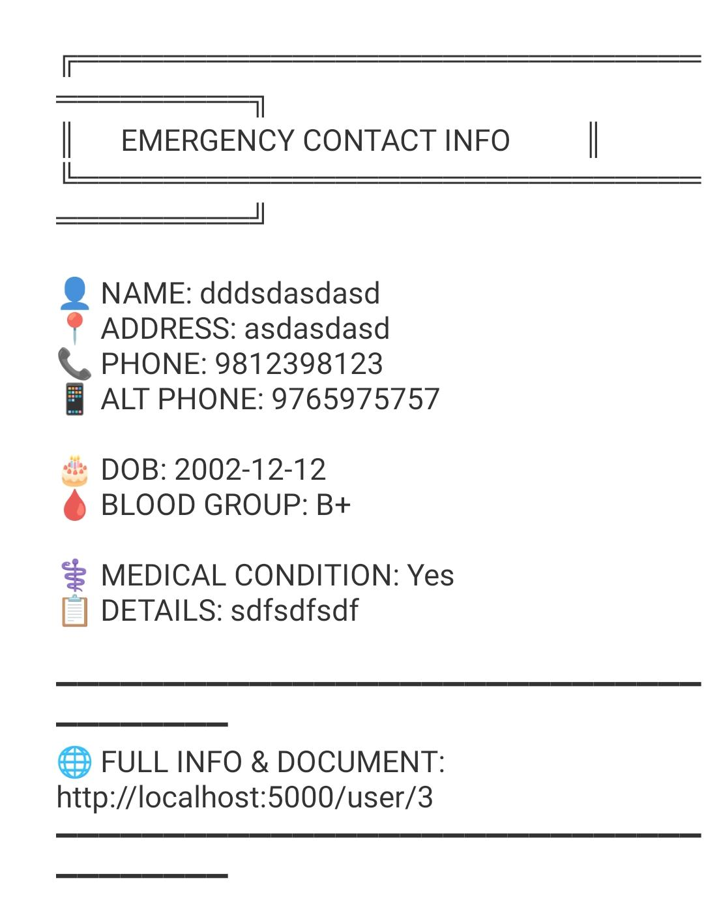

# 🆘 ResQR - Emergency Medical QR System

> **Scan. Save. Support.** - A life-saving emergency response system that stores critical medical information in QR codes for instant access during emergencies.

[](https://www.python.org/)
[](https://flask.palletsprojects.com/)
[](https://www.mysql.com/)
[](LICENSE)

---

## 📋 Table of Contents

- [About the Project](#about-the-project)
- [Features](#features)
- [Technology Stack](#technology-stack)
- [System Architecture](#system-architecture)
- [Prerequisites](#prerequisites)
- [Installation & Setup](#installation--setup)
- [Running the Application](#running-the-application)
- [Usage Guide](#usage-guide)
- [Project Structure](#project-structure)
- [Screenshots](#screenshots)
- [Future Enhancements](#future-enhancements)
- [Contributing](#contributing)
- [License](#license)

---

## 🎯 About the Project

**ResQR** is an innovative emergency medical information system designed for college mini-projects. It addresses a critical real-world problem: **providing instant access to medical information during emergencies**.

### The Problem
In emergency situations, first responders often lack immediate access to a patient's:
- Blood type
- Medical conditions
- Emergency contacts
- Allergies and medications

### The Solution
ResQR generates personalized QR codes containing comprehensive medical profiles. When scanned, these codes instantly display critical information that can save lives.

### Target Users
- 👤 **Patients**: Register and maintain their medical profiles
- 🏥 **Emergency Responders**: Quick access to patient information
- 👨‍💼 **Administrators**: Verify and approve registrations

---

## ✨ Features

### User Features
- ✅ **Secure Registration** - Create account with medical details
- 🔐 **Password Protection** - Hashed password storage using Werkzeug
- 📄 **Document Upload** - Attach medical reports (PDF, JPG, PNG)
- 📱 **Personal Dashboard** - View registration status and QR code
- 💾 **QR Code Download** - Download personalized emergency QR code

### Admin Features
- 🔍 **User Management** - View all registered users
- ✔️ **Approval System** - Approve or reject registrations
- 🎫 **Auto QR Generation** - Automatic QR code creation on approval
- 📊 **Dashboard Analytics** - Track pending/approved/rejected users
- 📥 **Document Access** - View uploaded medical documents

### Emergency Features
- 🚨 **Instant Information Access** - Scan QR to view medical profile
- 🌐 **Public Access Page** - No login required for emergency viewing
- 📋 **Comprehensive Data Display** - Name, blood group, contacts, conditions
- 📱 **Mobile Responsive** - Works on all devices

---

## 🛠️ Technology Stack

### Frontend
- **HTML5** - Semantic markup
- **CSS3** - Custom styling
- **Bootstrap 5.3** - Responsive UI framework
- **JavaScript** - Client-side validation

### Backend
- **Python 3.8+** - Core programming language
- **Flask 2.3.0** - Lightweight web framework
- **Flask-MySQLdb** - MySQL database integration
- **Werkzeug** - Password hashing and security

### Database
- **MySQL 8.0+** - Relational database management

### Libraries & Tools
- **qrcode 7.4.2** - QR code generation
- **Pillow 10.0.0** - Image processing
- **mysqlclient 2.2.0** - MySQL connector

---

## 🏗️ System Architecture

```
┌─────────────┐
│   Browser   │
└──────┬──────┘
       │
       ▼
┌─────────────────────────────────┐
│      Flask Application          │
│  ┌──────────────────────────┐  │
│  │   Routes & Controllers   │  │
│  └──────────────────────────┘  │
│  ┌──────────────────────────┐  │
│  │   Business Logic         │  │
│  │  - User Registration     │  │
│  │  - QR Generation         │  │
│  │  - Authentication        │  │
│  └──────────────────────────┘  │
└────────┬────────────────────────┘
         │
         ▼
┌─────────────────────────────────┐
│       MySQL Database            │
│  ┌──────────────────────────┐  │
│  │   users table            │  │
│  │  - Personal Info         │  │
│  │  - Medical Data          │  │
│  │  - QR Paths              │  │
│  └──────────────────────────┘  │
└─────────────────────────────────┘
```

---

## 📦 Prerequisites

Before you begin, ensure you have the following installed:

- **Python 3.8 or higher** - [Download Python](https://www.python.org/downloads/)
- **MySQL Server 8.0+** - [Download MySQL](https://dev.mysql.com/downloads/)
- **pip** - Python package manager (comes with Python)
- **Git** (optional) - For cloning the repository

### Verify Installation

```bash
# Check Python version
python --version

# Check pip version
pip --version

# Check MySQL installation
mysql --version
```

---

## 🚀 Installation & Setup

### Step 1: Clone or Download the Project

```bash
# Using Git
git clone https://github.com/yourusername/resqr.git
cd resqr

# OR download ZIP and extract
```

### Step 2: Create Virtual Environment (Recommended)

```bash
# Create virtual environment
python -m venv venv

# Activate virtual environment
# On Windows:
venv\Scripts\activate

# On macOS/Linux:
source venv/bin/activate
```

### Step 3: Install Python Dependencies

```bash
pip install -r help/requirements.txt
```

**Dependencies installed:**
- Flask==2.3.0
- flask-mysqldb==1.0.1
- qrcode==7.4.2
- Pillow==10.0.0
- mysqlclient==2.2.0

### Step 4: Setup MySQL Database

#### Option A: Using MySQL Command Line

```bash
# Login to MySQL
mysql -u root -p

# Create database and import schema
source help/database.sql

# OR manually:
CREATE DATABASE resqr_db;
USE resqr_db;
source help/database.sql;
```

#### Option B: Using MySQL Workbench

1. Open MySQL Workbench
2. Connect to your MySQL server
3. Go to **File → Run SQL Script**
4. Select `help/database.sql`
5. Execute the script

#### Option C: Using Python Setup Script

```bash
python help/setup_database.py
```

### Step 5: Configure Database Connection

Open `app.py` and update the MySQL configuration (lines 10-15):

```python
app.config['MYSQL_HOST'] = '127.0.0.1'      # Your MySQL host
app.config['MYSQL_USER'] = 'root'           # Your MySQL username
app.config['MYSQL_PASSWORD'] = 'your_password'  # Your MySQL password
app.config['MYSQL_DB'] = 'resqr_db'         # Database name
app.config['MYSQL_PORT'] = 3308             # Your MySQL port (default: 3306)
```

### Step 6: Create Required Folders

The application will auto-create these folders, but you can create them manually:

```bash
mkdir uploads
mkdir static/qrcodes
```

---

## ▶️ Running the Application

### Start the Flask Server

```bash
python app.py
```

You should see output like:

```
 * Serving Flask app 'app'
 * Debug mode: on
 * Running on http://127.0.0.1:5000
```

### Access the Application

Open your web browser and navigate to:

```
http://localhost:5000
```

---

## 📖 Usage Guide

### For Users

#### 1. Register an Account

1. Click **"Register"** on the homepage
2. Fill in all required fields:
   - Name, Address, Phone (10 digits)
   - Date of Birth, Blood Group
   - Disease status (Yes/No)
   - Disease details (optional)
   - Upload medical document (optional)
   - Create password (min 6 characters)
3. Click **"Submit Registration"**
4. Status will be **"Pending"** until admin approval

#### 2. Login to Dashboard

1. Click **"Login"**
2. Enter your phone number and password
3. View your registration status
4. Once approved, download your QR code

#### 3. Use Your QR Code

- Print the QR code and keep it in your wallet
- Attach it to your medical ID bracelet
- In emergencies, responders can scan it for instant information

### For Administrators

#### 1. Admin Login

1. Navigate to: `http://localhost:5000/admin/login`
2. Enter credentials:
   - **Username**: `admin`
   - **Password**: `admin123`

#### 2. Manage Users

1. View all registered users in the dashboard
2. Review user details and uploaded documents
3. **Approve** users to generate their QR codes
4. **Reject** users if information is invalid

#### 3. View Generated QR Codes

- Click **"View QR"** to see the generated QR code
- QR codes contain comprehensive medical information
- Users can download their QR codes from their dashboard

### For Emergency Responders

1. Scan the QR code using any QR scanner app
2. Opens a public page with patient information
3. View critical details:
   - Name and contact information
   - Blood group
   - Medical conditions
   - Emergency contacts
4. Download medical documents if available

---

## 📁 Project Structure

```
ResQR/
│
├── app.py                      # Main Flask application
├── README.md                   # Project documentation
├── .gitignore                  # Git ignore rules
│
├── help/                       # Setup and documentation
│   ├── database.sql            # MySQL database schema
│   ├── setup_database.py       # Database setup script
│   ├── migrate_database.py     # Database migration script
│   ├── requirements.txt        # Python dependencies
│   └── README.md               # Original documentation
│
├── templates/                  # HTML templates
│   ├── index.html              # Homepage
│   ├── register.html           # User registration
│   ├── user_login.html         # User login
│   ├── user_dashboard.html     # User dashboard
│   ├── user_details.html       # Public emergency info page
│   ├── admin_login.html        # Admin login
│   └── admin_dashboard.html    # Admin panel
│
├── static/                     # Static assets
│   ├── css/
│   │   └── style.css           # Custom styles
│   ├── js/
│   │   └── register.js         # Registration form validation
│   ├── images/                 # Image assets
│   └── qrcodes/                # Generated QR codes (auto-created)
│
├── uploads/                    # Uploaded medical documents (auto-created)
│
└── scripts/                    # Utility scripts
```

---

## 📸 Screenshots

### Homepage

*Landing page with call-to-action*

### User Registration

*Comprehensive registration form*

### Admin Dashboard

*User management interface*

### QR Code Display

*Generated emergency QR code*

### Emergency Information Page

*Public-facing emergency information*

---

## 🧪 Testing the Application

### Test Scenario 1: Complete User Flow

1. **Register a new user**
   - Go to Register page
   - Fill form with test data
   - Submit registration
   - Verify "Pending" status

2. **Admin approval**
   - Login as admin
   - View pending user
   - Click "Approve"
   - Verify QR code generation

3. **User login**
   - Login with registered phone/password
   - View "Approved" status
   - Download QR code

4. **Emergency access**
   - Scan QR code or visit: `http://localhost:5000/user/1`
   - Verify information display

### Test Scenario 2: Validation Testing

- Try registering with invalid phone (not 10 digits)
- Try duplicate phone number
- Test file upload with invalid formats
- Test password minimum length

---

## 🔒 Security Features

- ✅ **Password Hashing** - Werkzeug SHA256 hashing
- ✅ **Input Validation** - Frontend and backend validation
- ✅ **File Type Restrictions** - Only PDF, JPG, PNG allowed
- ✅ **Session Management** - Secure Flask sessions
- ✅ **SQL Injection Prevention** - Parameterized queries
- ✅ **Secure File Uploads** - Filename sanitization

---

## 🚧 Future Enhancements

- [ ] **SMS Notifications** - Alert users on approval
- [ ] **Email Integration** - Send QR codes via email
- [ ] **Multi-language Support** - Hindi, regional languages
- [ ] **GPS Location** - Track emergency location
- [ ] **Hospital Integration** - Direct hospital database access
- [ ] **Mobile App** - Native Android/iOS apps
- [ ] **Blockchain** - Immutable medical records
- [ ] **AI Chatbot** - Medical emergency guidance
- [ ] **Wearable Integration** - Smartwatch compatibility
- [ ] **Family Access** - Emergency contact notifications

---

## 🤝 Contributing

Contributions are welcome! Here's how you can help:

1. Fork the repository
2. Create a feature branch (`git checkout -b feature/AmazingFeature`)
3. Commit your changes (`git commit -m 'Add some AmazingFeature'`)
4. Push to the branch (`git push origin feature/AmazingFeature`)
5. Open a Pull Request

---

## 📄 License

This project is licensed under the MIT License - see the [LICENSE](LICENSE) file for details.

---

## 👥 Authors

**Shrikant Darekar** - *Initial work* - (https://github.com/shrikantbdarekar)

---

## 🙏 Acknowledgments

- Bootstrap team for the UI framework
- Flask community for excellent documentation
- College faculty for project guidance
- Open source community for inspiration

---

## 📞 Support

For issues, questions, or suggestions:

- 📧 Email: your.email@example.com
- 🐛 Issues: [GitHub Issues](https://github.com/yourusername/resqr/issues)
- 💬 Discussions: [GitHub Discussions](https://github.com/yourusername/resqr/discussions)

---

## 🌟 Show Your Support

Give a ⭐️ if this project helped you!

---

<div align="center">

  <sub>A college mini-project with real-world impact</sub>
</div>
